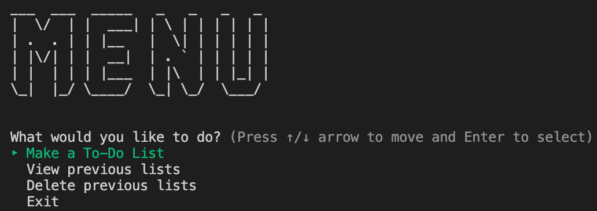
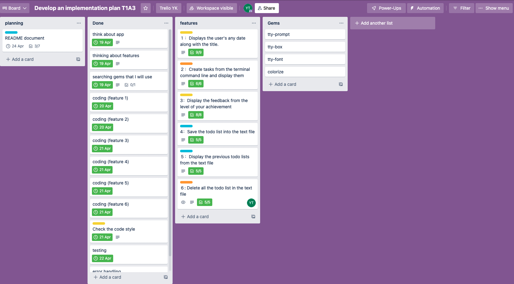
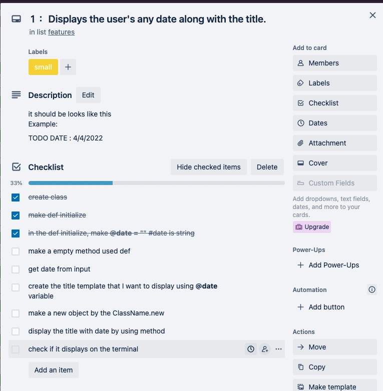
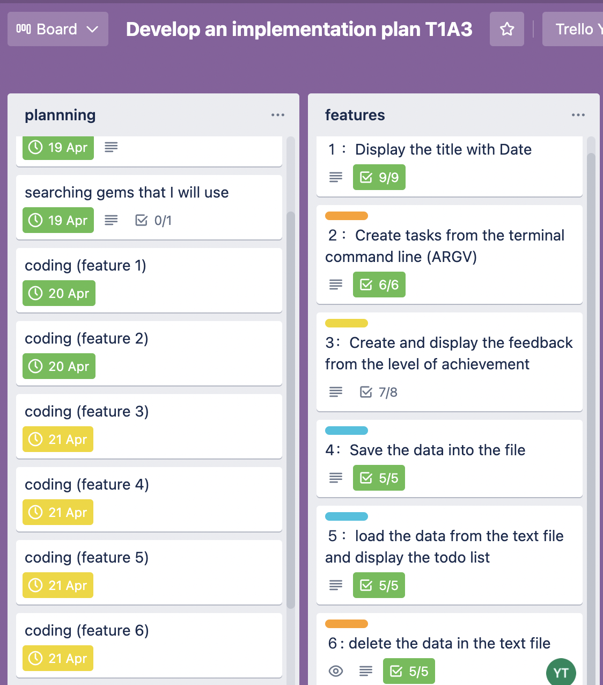

# Simple TODO List Application  

Simple app that makes and displays the todo-list. And then display the feedback of the to-do list after taking the level of achievement from users.
You can also view your previous lists, and delete the lists if you require.  
  
  
## **Features in this application**  

1. ### **Displays the user's any date along with the title**  
   Dates can be entered in any style you like.  
   For example: `4/24`, `4th April`, `4月24日`, etc.  
   
   The date obtained from the user will be displayed as follows.  
   ```
   ----------------
   TODO DATE: 4/24 
   ----------------
   ```

1. ### **Create tasks from the terminal command line and display them**  
   It gets the user's task from the terminal command line and displays the task line by line with the task number.  
   For example, when you run 
   ```
   $ ruby main.rb "Go to school" "Finish assignment" "Clean my room"
   ```
   The todo list tasks will be displayed as follows.  

   ```
   1: Go to school  
   2: Finish assignment  
   3: Clean my room
   ```
   If no tasks in the command line, the program will exit.  
   ```
   $ ruby main.rb

   => No tasks!! Add tasks in the command line!
   ```


1. ### **Display the feedback from the level of your achievement**
   The Feedback depends on how many tasks have been completed. Gets the number of finished tasks, and if the user finished all the tasks, the feedback says, `completed all the tasks!` but if the user still has unfinished tasks, then display the number of finished and unfinished tasks as the feedback.   

   For example, when the number of tasks is 3...  
   - When the number of finished tasks is also 3, the feedback will be displayed as below.  
   ```
   Feedback: Completed all the tasks!
   ```
   - When the number of finished tasks is 2, the feedback will be displayed as below.
   ```
   Feedback: You completed 2 tasks, and have 1 more tasks!
   ```
   - If the user type the number is invalid or not number, it will be displayed as below.
   ```
   Please enter the right number
   ```

1. ### **Save the todo list into the text file**  
   The date and tasks on the todo list are automatically saved in a text file called todo.txt.  
  
  
1. ### **Display the previous todo lists from the text file**
   From the main menu screen, select "View previous list" to display all previous todo lists with their dates.


1. ### **Delete all the todo list in the text file**
    From the main menu screen, select "Delete previous list" to detele all the previous todo lists.

## **Code Style Guide**
   The code for this application is written in the following code style using Rubocop.  
   - [rubocop GitHub](https://github.com/rubocop/rubocop)  
   - [rubocop Documentation](https://docs.rubocop.org/rubocop/index.html)  
   - [Ruby Style Guide](https://rubystyle.guide/)  

## **Implementation Plan**
   To track the implementation plan, I used Trello.  
   [Trello link](https://trello.com/invite/b/PGmgoJE3/8cb4f316075ff150ee4103dd9a5e37ab/develop-an-implementation-plan-t1a3)  

   The trello board has devided into 4 sections 'Planning' 'Done' 'features' and 'Gems'. I moved the cards in the planning section to the Done section when I finished the plan.  
    

   Each feature of the application was broken down and written out on a checklist and checked off as it was implemented.  
     

   Each planning card has the due.  
     


## **Help Documentation**

- ### **System/hardware Requirements**  
   The requirements is the same level as below.  
   - macOS 
     - Version 12.2.1 (21D62)
     - Memory 8 GV


- ### **Installation**
   [Terminal App: GitHub link is here](https://github.com/YPYT/Terminal_App_todo_list)  
     
   1. Move to the directory you want to add this terminal app in the terminal.  
   ``` 
   $ cd The_name_of_your_directory/
   ```  

   2. In the directory, execute:
   ```
   $ git clone git@github.com:YPYT/Terminal_App_todo_list.git
   ```  
   Press Enter to create a local clone.

   3. Now you have application files in the directory. Move to "Todo_list" directory, then follow the "Dependencies required by the application to operate" below.    
  　　  
  　　  
- ### **Dependencies required by the application to operate**
   This app require some gems, so make sure install these gems in the "Todo_list" directory before you start using.   
   Move to "Todo_list" directory: execute
   ``` 
   $ cd The_name_of_your_directory/Todo_list/
   ```

   - tty prompt  
     [tty-prompt GitHub link](https://github.com/piotrmurach/tty-prompt)  
     *Installation*  
     ```
     $ gem install tty-prompt
     ```  

   - tty font  
     [tty-font GitHub link](https://github.com/piotrmurach/tty-font)  
     *Installation*   
     ```
     $ gem install tty-font
     ```  

   - tty box  
     [tty-box GitHub link](https://github.com/piotrmurach/tty-box)
     *Installation*  
     ```
     $ gem install tty-box  
     ``` 

   - colorize  
     [colorize GitHub](https://github.com/fazibear/colorize)
     *Installation*  
     ```
     $ gem install colorize
     ```  
     
     **You can also install all the gems above by using bundler.(optional)**  
     [bundler website link](https://bundler.io/)
     
     ``` 
     $ gem install bundler
     ```

   - Make sure you have all the gem name in the Gemfile like below.  
     ``` 
     # frozen_string_literal: true

     source 'https://rubygems.org'

     # gem "rails"

     gem 'colorize'
     gem 'tty-box'
     gem 'tty-font'
     gem 'tty-prompt'
     ``` 

   - And then execute :
     ```
     $ bundle install 
     ```

- ### **How to use this app**
   This application use terminal command line arguments to make a todo list.    
   Move to "Todo_list" directory.  
   Then execute :  
   ```
   ruby $ main.rb "your first task here" "your second task here" "your third task here"
   ```
   You can add your task as many as you want, but there are some rules to write your tasks.  
   - Put a downcase white space after main.rb
   - Enclose tasks in double quotation marks (")
   - Put a downcase white space between the tasks  


- ### **Reference**
   
